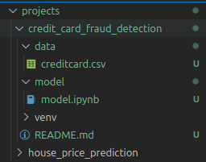

# Introduction and objectives

Hi, my name is Sara and this repository aims to make my projects available for my portfolio.
Feel free to share any feedbacks or suggestions.

## About folder hierarchy:

  

In the 'Projects' folder you will find all the projects divided by function and named after their main objective.

Inside each project you will see two folders named 'data' and 'model', where the dataframe and the model are located, respectively. 
Furthermore, there is also the 'README' file in order to explain about the project objectives.

